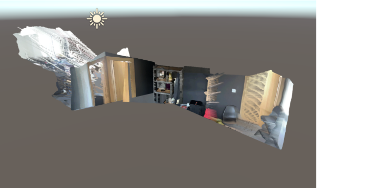
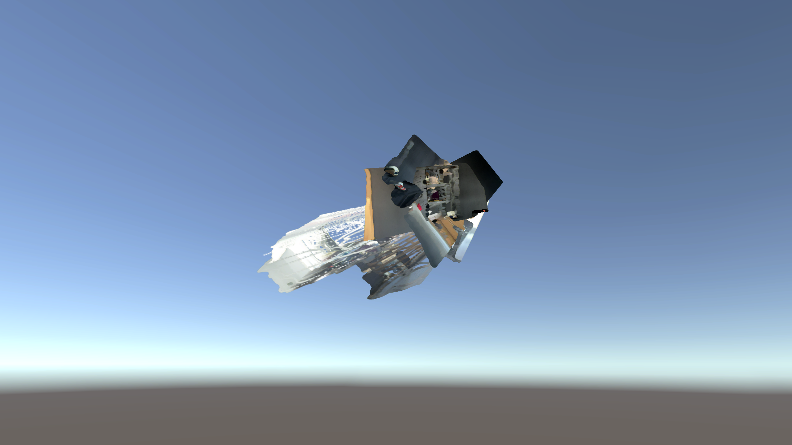

# Coordinate Converter

Converts the Delta Reality take-home data (three local point clouds + camera trajectory) into the coordinate system expected by the Unity viewer. **Work in progress:** the latest pipeline is closer (three views align as separate frustums with recognizable room textures), but it still does not match the reference layout when flying through the scene.

The commit history is intentionally granular — each commit is one hypothesis or verification step so you can follow how the solution was narrowed down.

## Target vs current result

Run the viewer after converting and applying files (see [Commands](#commands)):

```bash
Windows/ComputerVisionAssignment.exe
```

Hold **right mouse** to look; **W/A/S/D** move; **Q/E** up/down.

### Reference (assignment package)

What a correct conversion should look like (provided as `Windows/correct_view_sample.png` in the zip):



The three captures sit in a single shared world frame: walls, doorway, shelves, and furniture read as one interior from an outside “dollhouse” angle.

### My latest output

Screenshot from the same viewer after applying the current converter (`Windows/current_result.png`):



Compared with earlier attempts (smeared fans / exploded geometry), the latest run shows three camera frustums with room-like textures, but pieces still do not lock into one clean room the way the reference does.

## How I approached the task

1. **Read the viewer, don’t guess.** Disassembled `Assembly-CSharp.dll` (`PhotoPosesPlacer.LoadFromTrajFile`) and `3DGS.dll` (`PositionFromOpenCVtoUnity`) — see `scripts/decompile.py`, `scripts/inspect_dll.py`.
2. **Check raw data consistency.** `scripts/diagnose.py` samples each `imageN.ply`, applies the matching `traj.txt` row, and checks that all three clouds land in the same world region in the **source** frame (they do).
3. **Search basis changes.** `coordinate-converter search` over signed permutations; multi-view distance is flat across many candidates (similarity is invariant), so ranking alone is not enough.
4. **Model the real viewer pipeline.** `scripts/score_viewer.py` scores poses + “negate Y on PLY load” (what `3DGS.dll` does) vs variants (transpose traj, similarity on world frame, etc.).
5. **Current best hypothesis** (implemented in `src/coordinate_converter/convert.py`):
   - **PLY:** pass through unchanged — the loader already negates Y (`OpenCV → Unity`).
   - **Traj:** transpose the 3×3 rotation (file is column-major, Unity fills `m00..m33` in row order), then apply world similarity `T' = S · T · S⁻¹` with `S = diag(1, −1, 1)`.

Earlier commits tried Y/Z swaps on both PLY and traj, post-multiply poses, world translation hacks, and baking clouds — those are visible in `git log` and match the worse screenshots in the journey above.

## Requirements

- Python 3.11+
- [uv](https://docs.astral.sh/uv/) for dependency installation

## Setup

```bash
uv sync
```

## Input layout

The viewer package provides data under `StreamingAssets`:

- `Points/image1.ply`, `image2.ply`, `image3.ply` — local camera-space ASCII point clouds (`x y z red green blue`)
- `traj.txt` — three 4×4 camera poses (16 floats per line)

Extract the assignment `Windows.zip` locally. Viewer binaries and zips are not committed; reference screenshots are under `docs/` (copied from the assignment zip for README visibility).

**Important:** Convert from **raw** assignment data. After `apply`, a one-time copy of originals is kept in `backup/`. Use `backup/` or a copy such as `raw_input/` — not an already-converted `StreamingAssets` folder.

## Technical notes (viewer + source)

Decompiling `PhotoPosesPlacer.LoadFromTrajFile` shows:

- Each line → `Matrix4x4.m00..m33` in order.
- `transform.position` = `matrix.GetColumn(3)`; `transform.rotation` = `matrix.rotation`.
- Each splat root is a child of that transform → `world = pose · local` (with loader-side point fix).

`PositionFromOpenCVtoUnity` in `3DGS.dll` only **negates Y** on PLY positions at load time.

Raw data checks (`scripts/diagnose.py` on `backup/`):

- Camera positions ~`(3.97, −3.21, −1.45)`, `(4.52, −3.15, −1.40)`, `(4.71, −3.12, −1.40)` — spread along X.
- Forward ≈ `(−0.10, 0.07, −0.99)` → COLMAP-style, facing **−Z**.
- Transformed clouds overlap in source world (~`(4.3, −2.7, −3.7)`).

## Commands

Use raw input. After the first `apply`, unmodified assignment files are in `backup/` (same layout as `StreamingAssets`).

### Rank candidates (multi-view distance — many ties)

```bash
uv run coordinate-converter search \
  --input-dir backup \
  --sample-count 800 \
  --seed 42 \
  --top 10
```

### Rank candidates (depth heuristic — single PLY)

```bash
uv run coordinate-converter search-heuristic \
  --ply "backup/Points/image1.ply" \
  --sample-count 5000 \
  --seed 42 \
  --depth-threshold 0.1 \
  --top 10
```

### Convert

```bash
uv run coordinate-converter convert \
  --input-dir backup \
  --output-dir output
```

Produces `output/Points/image{1,2,3}.ply` and `output/traj.txt`. Generated `output/` is gitignored.

### Apply into the viewer (backs up originals once)

```bash
uv run coordinate-converter apply \
  --converted-dir output \
  --viewer-streaming-assets "Windows/ComputerVisionAssignment_Data/StreamingAssets" \
  --backup-dir backup
```

### Run the viewer

```bash
Windows/ComputerVisionAssignment.exe
```

Compare interactively with `docs/correct_view_sample.png`.

## Assumptions

- Trajectory rows are camera-to-world; the 3×3 block in the file is stored column-major relative to Unity’s row-wise `m**` assignment.
- Basis change on world frame is a signed permutation (no scale/shear).
- PLY is ASCII with `x y z red green blue`; colors are unchanged.

## Resources

- [Unity coordinate system](https://docs.unity3d.com/Manual/Coordinates.html)
- Similarity transform for poses: `T' = S T S⁻¹`
- [OpenCV camera coordinates](https://docs.opencv.org/4.x/d9/d0c/group__calib3d.html) (X right, Y down, Z forward)

## Repository layout

| Path | Role |
|------|------|
| `src/coordinate_converter/` | Converter, search, CLI |
| `scripts/` | DLL inspection, diagnostics, pipeline scoring |
| `docs/*.png` | Reference + latest result screenshots for reviewers |
| `backup/` | Raw `StreamingAssets` snapshot (gitignored) |
| `output/` | Last converted artifacts (gitignored) |

## Submission checklist

1. Push this repository; grant access to `vedran@deltareality.com` and `jstajdoh@deltareality.com`.
2. Include run instructions (this README) and source; attach converted `image*.ply` + `traj.txt` if too large for git (release asset or archive).
3. Note in your reply that the visual target is `docs/correct_view_sample.png` and describe remaining gap vs `docs/current_result.png`.
