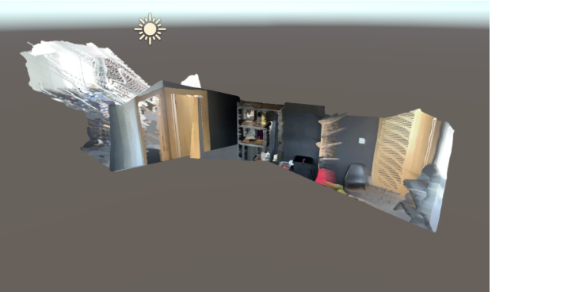
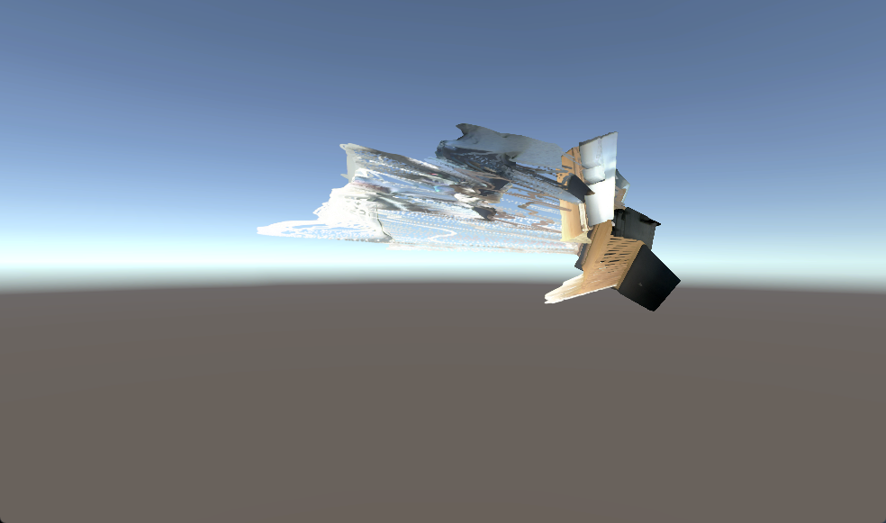

# Coordinate Converter

Converts the Delta Reality take-home input data into the coordinate system expected by the Unity viewer.

The solution writes replacement versions of:

- `Points/image1.ply`
- `Points/image2.ply`
- `Points/image3.ply`
- `traj.txt`

The conversion keeps the PLY files' positions unchanged, because the viewer's `3DGS.dll` already negates local point `y` when loading each PLY. The trajectory matrices compensate for that local loader transform, then remap the source world frame into the viewer world frame:

```text
viewer_pose = Translate(offset) * W * source_pose * L^-1

L = viewer local PLY load transform = diag(1, -1, 1)
W = source world -> viewer world =
    [ 0 0 1 ]
    [ 0 1 0 ]
    [ 1 0 0 ]
```

`W` preserves source/world `Y` as vertical and swaps source `X/Z` into the viewer's left-handed Unity-style frame. The offset is calculated from the converted point-cloud bounds so the room is centered horizontally and the lowest point sits just above the viewer ground.

## Reference and Verification

Assignment reference:



Current viewer sanity check from the generated files:



## Requirements

- Python 3.11+
- [uv](https://docs.astral.sh/uv/) for dependency installation

## Setup

### 1. Assignment package

Download and unzip the Windows assignment package:

[Delta Reality assignment - Windows zip](https://storage.divit.hr/share/1p6bzP_p)

After extracting, place the `Windows/` folder at the repository root:

```text
Windows/
  ComputerVisionAssignment.exe
  ComputerVisionAssignment_Data/
    StreamingAssets/
      Points/
        image1.ply
        image1.png
        image1_depth.png
        image1_rays.png
        image2.ply
        image2.png
        image2_depth.png
        image2_rays.png
        image3.ply
        image3.png
        image3_depth.png
        image3_rays.png
      traj.txt
```

The assignment zip, extracted viewer, raw input copies, and generated output are ignored by git.

### 2. Python environment

```bash
uv sync
```

## Commands

Use raw assignment data as input. After the first `apply`, the original viewer files are kept in `backup/`; use that folder for repeat conversions.

### Test

```bash
uv run python -m unittest discover -s tests
```

### Convert

```bash
uv run coordinate-converter convert \
  --input-dir backup \
  --output-dir output
```

This writes:

```text
output/
  Points/
    image1.ply
    image2.ply
    image3.ply
  traj.txt
```

### Apply to the viewer

```bash
uv run coordinate-converter apply \
  --converted-dir output \
  --viewer-streaming-assets "Windows/ComputerVisionAssignment_Data/StreamingAssets" \
  --backup-dir backup
```

### Run the viewer

```bash
Windows/ComputerVisionAssignment.exe
```

Viewer controls:

- Hold right mouse to look around.
- While holding right mouse, use `W/A/S/D` to move.
- Use `Q/E` to move down/up.

## Approach

1. Read the assignment and confirmed the deliverable is only the four replacement files plus source code and workflow documentation.
2. Inspected the Unity viewer IL:
   - `PhotoPosesPlacer.LoadFromTrajFile` reads each `traj.txt` row directly into `Matrix4x4.m00..m33`.
   - It uses `matrix.GetColumn(3)` as the Unity position and `matrix.rotation` as the Unity rotation.
   - `3DGS.dll` `PositionFromOpenCVtoUnity` negates only the local point `y`.
3. Checked the raw data:
   - The three raw PLY files are local camera-space point clouds with positive Z depth.
   - The raw trajectory rows are row-major camera-to-world matrices with translation in column 3.
   - Applying raw poses to raw local points puts the three clouds into the same source-world region.
4. Tested signed-permutation world bases in the viewer. The key observation was that source world `Y` already behaves like vertical: image-local down maps mostly toward negative source `Y`, so flipping world `Y` made the room harder to inspect. The selected world basis preserves source `Y` and swaps source `X/Z`.
5. Derived the conversion:
   - The viewer loads each raw PLY point as `L * p`, where `L = diag(1, -1, 1)`.
   - To display `W * (source_pose * p) + offset`, the viewer pose must be `Translate(offset) * W * source_pose * L^-1`.
   - `W` has determinant `-1`, so `W * R_source * L^-1` remains a proper rotation for Unity.
   - No rotation transpose is applied; the viewer reads the matrix in the same row-major layout used by the file.
6. Added unit tests for the viewer-pipeline invariant, PLY pass-through behavior, and deterministic framing offset.

## Assumptions

- `traj.txt` rows are row-major camera-to-world matrices.
- The PLY positions are camera-local coordinates in the source camera frame.
- The viewer's PLY loader always applies the local OpenCV-to-Unity Y flip.
- The source-to-viewer world change is a signed axis swap with no scale or shear.
- A translation offset is acceptable because the source origin is arbitrary relative to the viewer's default camera/ground.

## Repository Layout

| Path | Role |
|------|------|
| `src/coordinate_converter/` | Converter, CLI, PLY and trajectory parsing |
| `tests/` | Focused conversion invariant tests |
| `scripts/` | Diagnostic helpers used during investigation |
| `docs/*.png` | Assignment reference and final projection sanity check |
| `backup/` | Raw `StreamingAssets` snapshot, gitignored |
| `output/` | Generated replacement files, gitignored |

## Resources

- [Unity rotation and orientation manual](https://docs.unity3d.com/Manual/QuaternionAndEulerRotationsInUnity.html)
- [OpenCV camera coordinates](https://docs.opencv.org/4.x/d9/d0c/group__calib3d.html)
- Similarity transform for poses: `T_viewer = S * T_source * S^-1`
